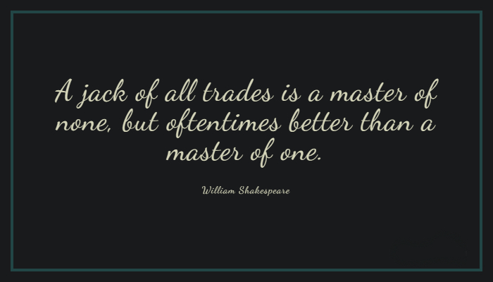

## What I Do
I spend time with computers, code, and ideas that make me curious.  
Most of it is exploring, experimenting, and keeping things simple.

---

## What I Learn
I try to learn anything I can, but mostly:
- algorithms, backend logic, and data handling  
- programming languages and better coding practices  
- building small projects across different stacks  
- revisiting old mistakes and fixing them with new skills  

---

## Mindset
- Make it exist first, make it better later  
- Less clutter, more clarity  
- Build to learn, not just to ship  
- The process is as important as the outcome  

---

Thats all for now.
